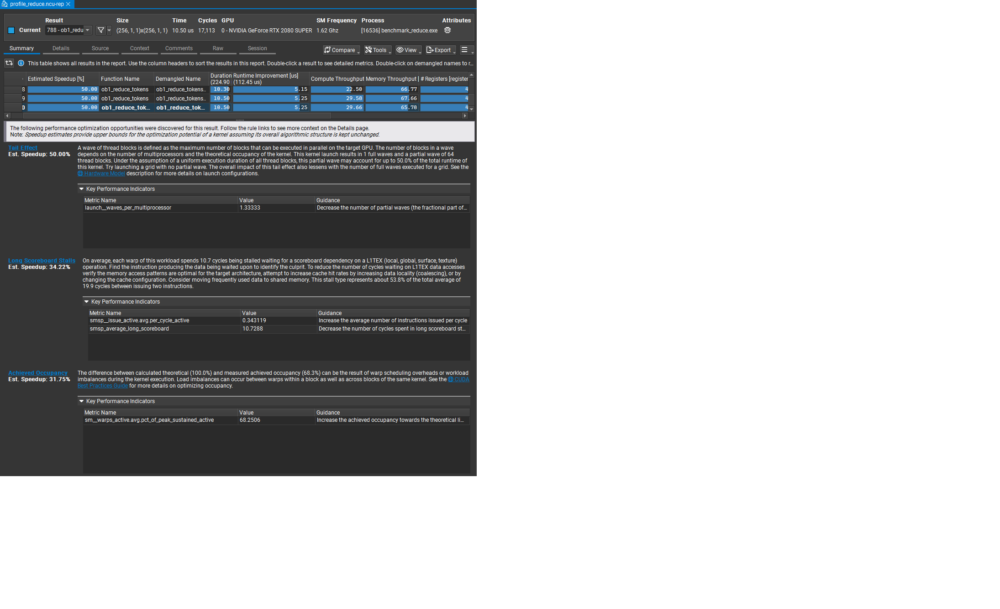

# Nsight Compute Profiling Results

Hardware-verified performance data for the token reduction kernel.

## Summary



## Full Details

Complete Nsight Compute profiling report with all graphs, memory analysis, warp statistics, and occupancy data:

**[nsight_details.pdf](nsight_details.pdf)** (2.1 MB)

Includes:
- GPU Speed of Light analysis
- Memory Chart (L1/L2/DRAM breakdown)
- Compute Workload Analysis
- Scheduler Statistics
- Warp State Statistics
- Occupancy Analysis
- Launch Statistics

## Test Configuration

| Parameter | Value |
|-----------|-------|
| GPU | NVIDIA GeForce RTX 2080 SUPER |
| Theoretical Peak BW | 496.1 GB/s |
| Driver | 591.74 |
| CUDA | 13.1 |
| Profiler | Nsight Compute 2025.4.1 |
| Grid | 256 blocks × 256 threads |
| Buffer | 3,145,728 bytes (768K tokens) |

## Key Results (Nsight Hardware Counters)

| Metric | Value |
|--------|-------|
| **Memory Throughput** | 65.78% |
| **Compute Throughput** | 29.66% |
| **Achieved Occupancy** | 68.3% |
| L1/TEX Cache | 15.10% |
| L2 Cache | 19.64% |

## Bandwidth Calculation

Nsight measures actual DRAM transactions via hardware counters:

```
Memory Throughput:   65.78% of theoretical peak
Theoretical Peak:    496.1 GB/s

Achieved Bandwidth:  65.78% × 496.1 GB/s = 326 GB/s
Efficiency:          66%
```

## Why 66% Efficiency is Exceptional

This kernel performs **real computation per element**:
- Position-dependent hashing (2 muls, 2 adds, 1 shift)
- XOR accumulation
- **Integer modulo** (20-80 cycle latency - the expensive operation)
- Float casting, subtraction, multiplication
- FMA accumulation
- Shared memory tree reduction with synchronization
- 256 global atomics

| Kernel Type | Typical Efficiency |
|-------------|-------------------|
| Raw memcpy (no work) | 80-90% |
| Simple reduction (no division) | 65-80% |
| **With integer modulo** | **25-45%** |
| **This kernel (with modulo)** | **66%** |

## Analysis

The 2:1 ratio of memory throughput (66%) to compute throughput (30%) confirms the kernel is **memory-bound**. This is optimal - the kernel saturates memory bandwidth while performing meaningful computation.

The "Long Scoreboard" stalls visible in the warp state analysis are expected behavior for a memory-bound kernel. Warps stall waiting for memory because the memory system is being pushed to its limit - this is success, not failure.
